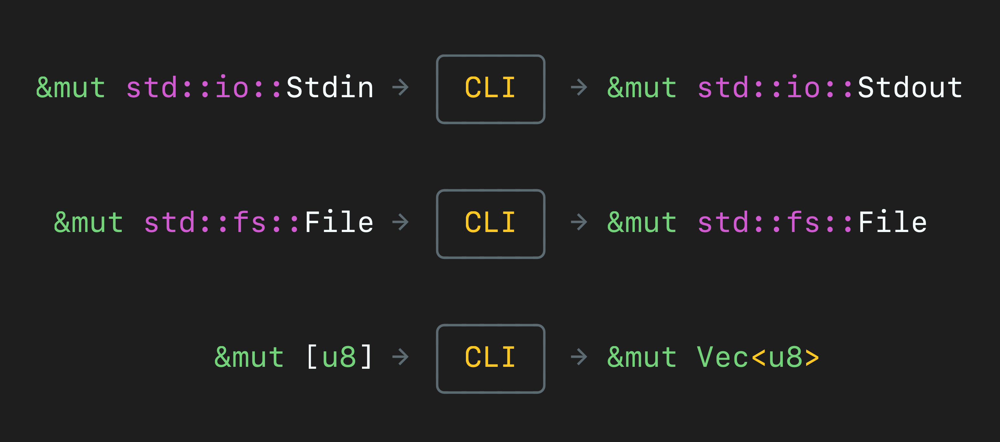

= Testing input and output in Rust command line applications
Jeff Kreeftmeijer <https://jeffkreeftmeijer.com>
2021-06-29
:description: Using abstraction through Rust’s Read and Write traits, we can swap the input and output for byte arrays and vectors during testing instead of capturing stdout.
:url: https://jeffkreeftmeijer.com/rust-stdin-stdout-testing/
:image: streams-dark-twitter.png
ifdef::env-github[]
:imagesdir: https://gist.githubusercontent.com/jeffkreeftmeijer/71f400a176f896c8f5b57a4628a7a889/raw
endif::[]

Working with complex input and output can make command line applications challenging to test, as it is inconvenient to capture the output stream to test if the program returns the correct output. Using abstraction through Rust's `Read` and `Write` traits, we can swap the input and output for byte arrays and vectors during testing instead.



== Standard Streams

_Standard streams_ are abstractions used to handle data input and output to an operating system process.
Each program has access to an input stream (_standard input_, or _stdin_), an output stream (_standard output_, or _stdout_), and an error stream (_standard error_, or _stderr_) inherited from the parent process.

.`grep(1)` filters lines read from stdin with a search pattern ("`three`" in this case) and prints the matching lines to stdout. After starting, `grep` halts to wait for input from stdin. By typing this input into the terminal, we can see that `grep` prints any line that matches the pattern back to stdout, which the terminal displays. Then, the program returns to waiting for input until it receives an _EOF_ (_end-of-file_), which we pass by pressing kbd:[ctrl]+kbd:[D] in the terminal.
====
[subs=+quotes]
----
$ grep three
one
two
three
_three_
----
====

Because of this abstraction, programs can use _pipelines_ to pass the output from one program as the input to another by piping stdout from one process to stdin for another.

.`ls(1)` prints the current directory's contents to stdout. This example uses a _pipe_ (`|`) to create a pipeline, to pass the output from `ls` as input to `grep`. `grep` then filters to only print lines matching the passed pattern ("`Cargo`").
====
[subs=+quotes]
----
$ ls -l ~/pager | grep Cargo
_Cargo.lock_
_Cargo.toml_
----
====

== `Stdin`, `Stdout` and `Stderr` in Rust

Rust provides handles to the standard streams through the https://doc.rust-lang.org/std/io/struct.Stdin.html[`Stdin`], https://doc.rust-lang.org/std/io/struct.Stdout.html[`Stdout`] and https://doc.rust-lang.org/std/io/struct.Stderr.html[`Stderr`] structs, which are created with the https://doc.rust-lang.org/std/io/fn.stdin.html[`io::stdin()`], https://doc.rust-lang.org/std/io/fn.stdout.html[`io::stdout()`] and https://doc.rust-lang.org/std/io/fn.stderr.html[`io::stderr()`] functions respectively.

.This program takes input through stdin, converts the received string to uppercase and prints it back out to the terminal through stdout.
[#upcase]
====
.`src/main.rs`
```rust
use std::io;
use std::io::{Read, Write};

fn main() -> io::Result<()> {
    let mut buffer = "".to_string();

    io::stdin().read_to_string(&mut buffer)?;
    io::stdout().write_all(buffer.to_uppercase().as_bytes())?;

    Ok(())
}
```
====

The stream handlers implement the https://doc.rust-lang.org/std/io/trait.Read.html[`Read`] and https://doc.rust-lang.org/std/io/trait.Write.html[`Write`] traits to read from and write to the streams. Because of that, they share part of their implementation with other "`Readers`" and "`Writers`", like https://doc.rust-lang.org/std/fs/struct.File.html[`File`].

== Abstraction using the `Read` and `Write` traits

One of the issuesfootnote:[Another issue with this example is that it uses https://doc.rust-lang.org/std/io/trait.Read.html#method.read_to_string[`Read::read_to_string()`], which will read the contents of the whole stream from the input before writing everything to stdout at once, which is inefficient, especially for larger inputs. A more efficient implementation could use buffered reading through the `BufRead` trait to read and write the input stream line by line.] in the <<upcase, example>> above is that it uses the `Stdout` and `Stdin` structs directly, making our program challenging to test because it is inconvenient to pass input through stdin and capture stdout to assert that the program produces the correct results.

To make our program more modular, we will decouple it from the `Stdin` and `Stdout` structs and pass the input and output as arguments to a more abstract, separate function.

.In the test for the extracted function, we swap `Stdin` and `Stdout` out for other implementors of the `Read` and `Write` traits: a byte array for input and a vector for output.
====
.`src/lib.rs`
```rust
#[cfg(test)]
mod tests {
    use super::*;

    #[test]
    fn writes_upcased_input_to_output() {
        let mut output: Vec<u8> = Vec::new();

        upcase(&mut "Hello, world!\n".as_bytes(), &mut output).unwrap();
        assert_eq!(&output, b"HELLO, WORLD!\n");
    }
}
```
====

.The implementation that satisfies the test looks like the <<upcase, original example>>, with one significant difference. Because the test passes the input and output as arguments, we can use trait objects to allow any type as long as it implements the `Read` and `Write` traits:
====
.`src/lib.rs`
```rust
pub fn upcase(
    input: &mut dyn Read,
    output: &mut dyn Write,
) -> Result<(), Error> {
    let mut buffer = "".to_string();

    input.read_to_string(&mut buffer)?;
    output.write_all(buffer.to_uppercase().as_bytes())?;

    Ok(())
}
```
====

.Finally, we replace the prototype in `src/main.rs` with a call to our new implementation with a `Stdin` and `Stdout` struct for the input and output:
====
.`src/main.rs`
```
use std::io;

fn main() -> io::Result<()> {
    upcase::upcase(&mut io::stdin(), &mut io::stdout())
}
```
====

By abstracting `Stdin` and `Stdout` out of the implementation, we made our program more modular, allowing us to test the code without resorting to capturing stdout to assert that the printed result matched our expectations.

Aside from better testability, making our implementation more modular will allow us to work with other data types in the future.
For example, we might add a command-line option that takes a filename and pass a `File` to `upcase()`.
Since `File` also implements the `Read` trait, that would work without further modifications in our implementation.
